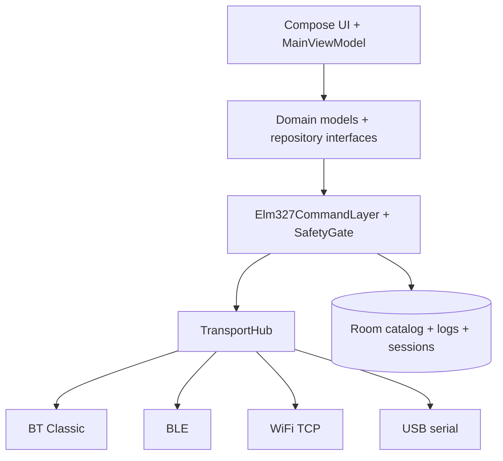
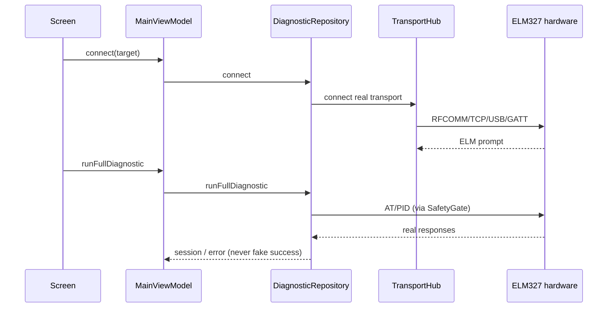

# Architecture

Clean Architecture + MVVM + Repository + Hilt + Room + Compose.

```mermaid
flowchart TB
  UI[Compose UI + MainViewModel]
  DOM[Domain models + repository interfaces]
  HUB[TransportHub]
  T1[BT Classic]
  T2[BLE]
  T3[WiFi TCP]
  T4[USB serial]
  ELM[Elm327CommandLayer + SafetyGate]
  ROOM[(Room catalog + logs + sessions)]

  UI --> DOM
  DOM --> ELM
  ELM --> HUB
  HUB --> T1 & T2 & T3 & T4
  ELM --> ROOM
```

```mermaid
sequenceDiagram
  participant Screen
  participant VM as MainViewModel
  participant Repo as DiagnosticRepository
  participant Hub as TransportHub
  participant Adapter as ELM327 hardware

  Screen->>VM: connect(target)
  VM->>Repo: connect
  Repo->>Hub: connect real transport
  Hub->>Adapter: RFCOMM/TCP/USB/GATT
  Adapter-->>Hub: ELM prompt
  Screen->>VM: runFullDiagnostic
  VM->>Repo: runFullDiagnostic
  Repo->>Adapter: AT/PID (via SafetyGate)
  Adapter-->>Repo: real responses
  Repo-->>VM: session / error (never fake success)
```

Start destination: **Connect** screen. Diagnostic actions require `ConnectionState.CONNECTED`.
