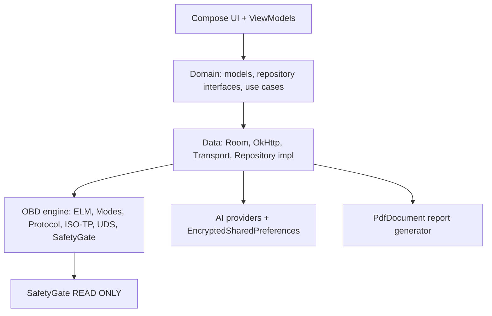
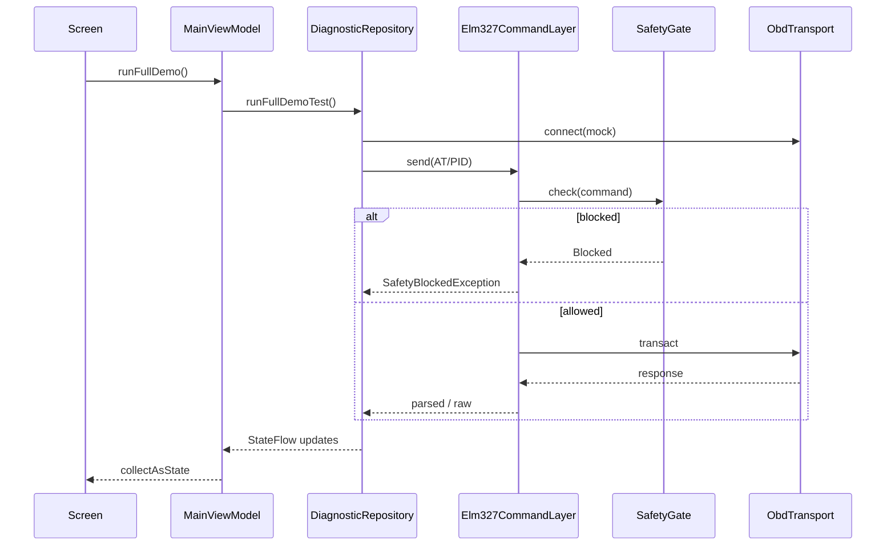

# Architecture — OBD Master Intelligence Tester AI

## Overview

Clean Architecture + MVVM + Repository, Kotlin, Jetpack Compose, Hilt DI, Room persistence, Coroutines/Flow.



## Layers

| Layer | Package | Responsibility |
|-------|---------|----------------|
| Presentation | `ui.*` | Compose screens, `MainViewModel`, navigation drawer |
| Domain | `domain.*` | Models, repository contracts — no Android deps |
| Data | `data.*` | Room, remote stub, transport, repository implementations |
| OBD | `obd.*` | Command builders/parsers, protocol discovery, safety |
| Cross-cutting | `ai`, `pdf`, `scoring`, `vehicle`, `knowledge`, `di` | Features + Hilt module |

## MVVM data flow



## Package map

```
com.obdmaster.intelligence
├── di/AppModule.kt
├── ui/ (MainActivity, MainViewModel, screens/*, components, theme, navigation)
├── domain/model + repository
├── data/local (Room) + remote + transport + repository
├── obd/modes, protocol, adapter, elm, safety, isotp, uds
├── ai/, pdf/, scoring/, vehicle/, knowledge/
```

## Dependency rule

UI → Domain ← Data. OBD/AI/PDF are injected into Data/Repository via Hilt `@Singleton` providers. Domain never imports Android framework types (except `java.io.File` on report contract).
